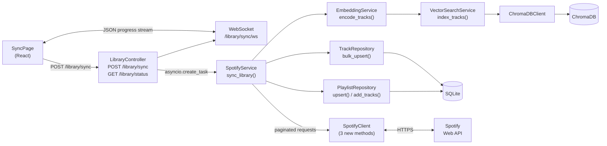

# Week 3 Setup Guide — Phase 2: Library Sync & Track Storage

## Overview

This guide documents everything implemented in Week 3 (Phase 2) of the Sounds Good project. The goal of this phase is to fetch a user's full Spotify library, store tracks in SQLite, generate vector embeddings, and stream real-time progress to the frontend.

**Prerequisite:** Phase 1 (auth) is complete. The following already exist and are treated as foundations here:

| Component | File |
|---|---|
| Spotify OAuth + JWT | `auth_controller.py`, `spotify_auth_service.py` |
| Token encryption | `utils/token_encryptor.py` |
| DB models | `models/user.py`, `models/track.py`, `models/playlist.py`, `models/spotify_token.py` |
| Pydantic schemas | `schemas/track_schema.py`, `schemas/playlist_schema.py` |
| `SpotifyClient` (auth methods) | `clients/spotify_client.py` |
| Frontend auth flow | `LoginPage`, `CallbackPage`, `useAuth`, `ProtectedRoute` |

---

## Architecture



---

## Implementation Cycle

Each section below follows the pattern: **implement → test → confirm green → proceed.**

---

## Step 1: Alembic `target_metadata` Fix

**File:** [`backend/alembic/env.py`](../../backend/alembic/env.py)

`target_metadata` was set to `None`, preventing `alembic revision --autogenerate` from detecting model changes.

```python
# Before (broken)
target_metadata = None

# After
target_metadata = Base.metadata
```

`Base` was already imported at the top of `env.py` — this was a one-line fix.

No tests required; the fix was verified by successfully running `alembic revision --autogenerate` in Step 3b.

---

## Step 2: `SpotifyClient` — New Data-Fetching Methods

**File:** [`backend/src/clients/spotify_client.py`](../../backend/src/clients/spotify_client.py)

Three async methods added to `SpotifyClient`:

### `get_user_playlists`

```python
async def get_user_playlists(
    self, access_token: str, offset: int = 0, limit: int = 50
) -> dict:
```

Calls `GET /me/playlists`. Returns a Spotify paging object (`items`, `total`, `next`, `offset`, `limit`). Raises `ExternalServiceError` on any non-200.

### `get_playlist_tracks`

```python
async def get_playlist_tracks(
    self,
    access_token: str,
    playlist_id: str,
    offset: int = 0,
    limit: int = 100,
) -> dict:
```

Calls `GET /playlists/{id}/tracks` with a `fields` filter to minimise response size. Returns paging object where each `item.track` has `id`, `name`, `artists`, `duration_ms`.

### `get_audio_features`

```python
async def get_audio_features(
    self, access_token: str, track_ids: list[str]
) -> list[dict]:
```

Calls `GET /audio-features?ids=...` in **batches of 100** (Spotify's maximum). Filters out `None` entries (features unavailable for local/podcast tracks). Empty input returns immediately without making any HTTP calls.

### Tests

**File:** `backend/tests/unit/test_spotify_client.py` — 12 tests

```
TestGetUserPlaylists   3 tests  — returns paging object, correct params, raises on non-200
TestGetPlaylistTracks  3 tests  — returns paging object, correct URL+params, raises on non-200
TestGetAudioFeatures   6 tests  — returns features, filters None, batches 150→2 calls,
                                  correct ids param format, raises on non-200, empty no-op
```

Run: `poetry run pytest tests/unit/test_spotify_client.py -v`

---

## Step 3: Repositories

### Step 3a: `TrackRepository`

**New file:** [`backend/src/repositories/track_repository.py`](../../backend/src/repositories/track_repository.py)

| Method | Signature | Description |
|---|---|---|
| `get_by_user` | `(db, user_id) → list[Track]` | All tracks for a user |
| `delete_stale` | `(db, user_id) → int` | Delete tracks with `cached_at < now - 24h`; returns count deleted |
| `bulk_upsert` | `(db, user_id, tracks_data) → list[Track]` | Calls `delete_stale` first, then match-on-`spotify_track_id` update-or-insert |

Key design decisions:
- `audio_features` dict is serialised to JSON string (`Text` column) in `bulk_upsert` and deserialised in the Pydantic schema's `@field_validator`.
- Matching uses a Python-level dict `{spotify_track_id: Track}` built from one `SELECT` — avoids N+1 per track.
- Empty `tracks_data` is a fast no-op (returns `[]`).

### Step 3b: `Playlist` model + migration

`spotify_playlist_id` was added to the `Playlist` model (nullable `String(22)`, indexed). This allows the repository to distinguish Spotify-sourced playlists from AI-generated ones (Phase 4+).

```python
spotify_playlist_id: Mapped[str | None] = mapped_column(
    String(22), nullable=True, index=True
)
```

Migration generated and applied:

```bash
poetry run alembic revision --autogenerate -m "add_spotify_playlist_id_to_playlists"
poetry run alembic upgrade head
```

Migration file: `alembic/versions/6b10ba2c0a55_add_spotify_playlist_id_to_playlists.py`

### Step 3c: `PlaylistRepository`

**New file:** [`backend/src/repositories/playlist_repository.py`](../../backend/src/repositories/playlist_repository.py)

| Method | Signature | Description |
|---|---|---|
| `get_by_user` | `(db, user_id) → list[Playlist]` | All playlists for a user |
| `upsert` | `(db, user_id, spotify_playlist_id, name) → Playlist` | Create or update playlist by Spotify ID |
| `add_tracks` | `(db, playlist_id, track_ids_with_positions)` | Replace all `PlaylistTrack` rows for a playlist |

`add_tracks` does a full replace (delete then insert) so re-sync always produces a clean state.

### Tests

**Files:**
- `backend/tests/unit/test_track_repository.py` — 11 tests
- `backend/tests/unit/test_playlist_repository.py` — 8 tests

All use the conftest's transactional SQLite `db` fixture for per-test isolation.

```
TestBulkUpsert      7 tests  — insert, update, no duplicate, JSON features, null features,
                               cached_at set, empty no-op
TestDeleteStale     3 tests  — removes >24h, keeps fresh, doesn't touch other users
TestGetByUser       1 test   — user isolation
TestUpsert          5 tests  — create, update name, no duplicate, separate IDs, user isolation
TestAddTracks       3 tests  — positions correct, full replace on second call, empty clears
```

Run: `poetry run pytest tests/unit/test_track_repository.py tests/unit/test_playlist_repository.py -v`

---

## Step 4: `ChromaDBClient` + `EmbeddingService`

### `ChromaDBClient`

**New file:** [`backend/src/clients/chromadb_client.py`](../../backend/src/clients/chromadb_client.py)

Wraps `chromadb.HttpClient`. One collection per user, named `user_{uuid_without_hyphens}`.

| Method | Description |
|---|---|
| `get_or_create_collection(user_id)` | Returns collection with `hnsw:space: cosine` |
| `add_documents(collection, ids, embeddings, metadatas)` | Calls `collection.upsert(...)` — idempotent |
| `query(collection, query_embedding, n_results)` | Returns `list[dict]` of metadata ordered by similarity |
| `delete_collection(user_id)` | Silently no-ops if collection doesn't exist |

### `EmbeddingService`

**New file:** [`backend/src/services/embedding_service.py`](../../backend/src/services/embedding_service.py)

Uses `sentence-transformers` model `all-MiniLM-L6-v2` (384-dimensional vectors).

| Method | Description |
|---|---|
| `encode_tracks(tracks)` | Builds `"{name} {artist}"` text per track, batch-encodes, returns `list[list[float]]` |
| `encode_query(text)` | Encodes a single query string, returns `list[float]` |

The model is **lazy-loaded** on the first encode call to avoid blocking application startup.

### Tests

**Files:**
- `backend/tests/unit/test_chromadb_client.py` — 12 tests
- `backend/tests/unit/test_embedding_service.py` — 11 tests

> **Note on test helpers:** SQLAlchemy ORM objects cannot be created with `__new__` outside a session (instrumentation fails). Use `types.SimpleNamespace` to build lightweight Track-like objects for unit tests that don't touch the DB.

> **Note on patching `SentenceTransformer`:** The import is inside `_get_model()`, so patch at `sentence_transformers.SentenceTransformer`, not at the service module.

Run: `poetry run pytest tests/unit/test_chromadb_client.py tests/unit/test_embedding_service.py -v`

---

## Step 5: `VectorSearchService`

**New file:** [`backend/src/services/vector_search_service.py`](../../backend/src/services/vector_search_service.py)

Orchestrates `ChromaDBClient` + `EmbeddingService`.

| Method | Description |
|---|---|
| `index_tracks(user_id, tracks)` | Encodes tracks → upserts into ChromaDB with metadata `{spotify_track_id, name, artist, duration_ms}` |
| `search(user_id, query_text, n_results)` | Encodes query → queries ChromaDB → returns `list[spotify_track_id]` |
| `clear_user_tracks(user_id)` | Deletes then recreates the user's collection (full re-sync) |

Both `ChromaDBClient` and `EmbeddingService` are injected via constructor for testability.

### Tests

**File:** `backend/tests/unit/test_vector_search_service.py` — 12 tests

> **Note on positional args:** `add_documents` is called with positional args, so assertions must use `call_args.args`, not `call_args.kwargs`.

Run: `poetry run pytest tests/unit/test_vector_search_service.py -v`

---

## Step 6: `SpotifyService`

**New file:** [`backend/src/services/spotify_service.py`](../../backend/src/services/spotify_service.py)

The main sync orchestrator. All dependencies are injected for testability.

### `sync_library` flow

```
1. get_valid_access_token(user_id, db)
2. Paginate all playlists  →  list[playlist_dict]
3. For each playlist:
   a. Paginate all tracks  →  accumulate tracks_data + playlist_track_map
   b. upsert playlist record
   c. call on_progress(playlists_done, total_playlists, tracks_done)
4. Batch-fetch audio features (100 at a time)
5. Attach features to tracks_data
6. Deduplicate tracks (same track can appear in multiple playlists)
7. TrackRepository.bulk_upsert(db, user_id, unique_tracks_data)
8. Wire up playlist→track relationships via PlaylistRepository.add_tracks
9. VectorSearchService.index_tracks(user_id, upserted_tracks)
10. Return {"playlists_synced": N, "tracks_synced": M}
```

### Exponential backoff

The helper `_with_backoff(coro_factory)` wraps any Spotify call. On `ExternalServiceError` it sleeps with doubling delay (`1s → 2s → 4s → … → 64s max`) up to 5 retries.

```python
async def _with_backoff(coro_factory):
    backoff = 1.0
    for attempt in range(5):
        try:
            return await coro_factory()
        except ExternalServiceError:
            await asyncio.sleep(backoff)
            backoff = min(backoff * 2, 64.0)
    raise ExternalServiceError("Spotify", "Max retries exceeded")
```

### `on_progress` callback

Accepts both sync and async callables: `(playlists_done, total_playlists, tracks_done) → None | Awaitable`.

### Tests

**File:** `backend/tests/unit/test_spotify_service.py` — 13 tests

```
TestSyncLibraryBasicFlow  5 tests  — counts, token retrieval, bulk_upsert called, vector indexed,
                                     audio features attached
TestPagination            3 tests  — playlist pages, track pages, deduplication
TestProgressCallback      3 tests  — called once per playlist, increments, async callback
TestExponentialBackoff    2 tests  — retries on 429, raises after max retries
```

Run: `poetry run pytest tests/unit/test_spotify_service.py -v`

---

## Step 7: `LibraryController`

**New file:** [`backend/src/controllers/library_controller.py`](../../backend/src/controllers/library_controller.py)

Registered in [`backend/src/main.py`](../../backend/src/main.py) at prefix `/library`.

### Endpoints

#### `POST /library/sync` (authenticated)

Starts an `asyncio.create_task` background sync. Returns immediately with `{"status": "started"}`. The background task writes progress to the in-memory `_sync_state` dict which the WebSocket polls.

On completion: calls `db.commit()`. On error: calls `db.rollback()` and writes `{"status": "error", "error": "<message>"}`.

#### `GET /library/status` (authenticated)

Returns the current `_sync_state` for the user. Shape:

```json
{
  "status": "idle | syncing | complete | error",
  "playlists_done": 5,
  "total_playlists": 12,
  "tracks_done": 1200,
  "error": null
}
```

Initial value for a user is `{"status": "idle"}`.

#### `WebSocket /library/sync/ws?token=<jwt>`

Authentication: the JWT is passed as a query parameter (WebSocket handlers can't use `Depends` for headers). Invalid tokens trigger `ws.close(code=4001)`.

Once authenticated, the server pushes the current `_sync_state` every 500 ms until `status` is `"complete"` or `"error"`, then closes.

> **Production note:** The `_sync_state` dict is in-process memory. In a multi-worker deployment this must be replaced with Redis.

### Tests

**File:** `backend/tests/integration/test_library_controller.py` — 9 tests

```
TestPostSync       3 tests  — 401 unauth, 200 + "started", 401 bad token
TestGetStatus      4 tests  — 401 unauth, 200 with status field, idle default, reflects set state
TestSyncWebSocket  2 tests  — bad token closes with 4001, valid token receives JSON messages
```

> **WebSocket disconnect in TestClient:** When the server calls `ws.close(code=4001)` before the client sends any message, Starlette's `TestClient` raises `WebSocketDisconnect` at context manager `__enter__`. Wrap the `websocket_connect` call in `pytest.raises(WebSocketDisconnect)`.

Run: `poetry run pytest tests/integration/test_library_controller.py -v`

---

## Step 8: Frontend

### `api.ts` additions

**File:** [`frontend/src/services/api.ts`](../../frontend/src/services/api.ts)

```typescript
export const startLibrarySync = () =>
  api.post<{ status: string }>('/library/sync')

export const getLibraryStatus = () =>
  api.get<{
    status: string
    playlists_done?: number
    total_playlists?: number
    tracks_done?: number
    error?: string | null
  }>('/library/status')
```

### Environment variables

**Files:** `frontend/.env.example`, `frontend/.env`

```
VITE_WS_URL=ws://localhost:8000
```

### `useSyncProgress` hook

**New file:** [`frontend/src/hooks/useSyncProgress.ts`](../../frontend/src/hooks/useSyncProgress.ts)

```typescript
const { status, playlistsDone, totalPlaylists, tracksDone, error, startSync, reset } =
  useSyncProgress()
```

**Lifecycle:**
1. `startSync()` → calls `POST /library/sync`
2. Opens `WebSocket ws://<VITE_WS_URL>/library/sync/ws?token=<jwt>`
3. Parses incoming JSON into `SyncProgressState`
4. On `complete` or `error`: the component reacts; socket is closed
5. Cleanup on unmount closes the socket

**`SyncStatus` type:** `'idle' | 'starting' | 'syncing' | 'complete' | 'error'`

### `SyncPage` — full implementation

**File:** [`frontend/src/pages/SyncPage.tsx`](../../frontend/src/pages/SyncPage.tsx)

Four render states:

| State | Shown when | Content |
|---|---|---|
| **Idle** | `status === 'idle'` | Library icon + description + "Sync library" button |
| **Syncing** | `status === 'starting'` or `'syncing'` | Animated music bars + progress bar + `"X / Y playlists · Z tracks found"` |
| **Complete** | `status === 'complete'` | Check icon + track count summary + auto-navigate to `/generate` after 1.5 s |
| **Error** | `status === 'error'` | Error icon + message + "Try again" button that calls `reset()` |

Progress bar width: `(playlistsDone / totalPlaylists) * 100%` with a CSS `transition-all duration-500`.

---

## Running All Tests

```bash
cd backend
poetry run pytest --no-cov -q
```

Expected output: **108 passed** (as of the end of this phase).

| Test file | Tests |
|---|---|
| `tests/unit/test_spotify_client.py` | 12 |
| `tests/unit/test_track_repository.py` | 11 |
| `tests/unit/test_playlist_repository.py` | 8 |
| `tests/unit/test_chromadb_client.py` | 12 |
| `tests/unit/test_embedding_service.py` | 11 |
| `tests/unit/test_vector_search_service.py` | 12 |
| `tests/unit/test_spotify_service.py` | 13 |
| `tests/integration/test_library_controller.py` | 9 |
| Phase 1 tests (carried over) | 20 |

---

## Files Created / Modified

### Backend

| Action | File |
|---|---|
| Modified | `alembic/env.py` |
| Modified | `src/clients/spotify_client.py` |
| Modified | `src/models/playlist.py` |
| Modified | `src/main.py` |
| New migration | `alembic/versions/6b10ba2c0a55_add_spotify_playlist_id_to_playlists.py` |
| New | `src/clients/chromadb_client.py` |
| New | `src/repositories/track_repository.py` |
| New | `src/repositories/playlist_repository.py` |
| New | `src/services/embedding_service.py` |
| New | `src/services/vector_search_service.py` |
| New | `src/services/spotify_service.py` |
| New | `src/controllers/library_controller.py` |
| New | `tests/unit/test_spotify_client.py` |
| New | `tests/unit/test_track_repository.py` |
| New | `tests/unit/test_playlist_repository.py` |
| New | `tests/unit/test_chromadb_client.py` |
| New | `tests/unit/test_embedding_service.py` |
| New | `tests/unit/test_vector_search_service.py` |
| New | `tests/unit/test_spotify_service.py` |
| New | `tests/integration/test_library_controller.py` |

### Frontend

| Action | File |
|---|---|
| Modified | `src/services/api.ts` |
| Modified | `src/pages/SyncPage.tsx` |
| Modified | `.env.example` |
| Modified | `.env` |
| New | `src/hooks/useSyncProgress.ts` |

---

## Acceptance Criteria

- [x] All playlists and tracks fetched from Spotify (paginated)
- [x] Tracks stored in SQLite with `cached_at`; stale tracks purged after 24 hours
- [x] Audio features attached to each track (batched in 100s)
- [x] Tracks across multiple playlists deduplicated before storage
- [x] Playlist → track relationships stored with positions
- [x] Embeddings generated (`all-MiniLM-L6-v2`) and persisted in ChromaDB per user
- [x] `POST /library/sync` returns 401 without a valid JWT
- [x] WebSocket streams `{status, playlists_done, total_playlists, tracks_done}` in real time
- [x] `SyncPage` transitions: idle → syncing → complete (auto-redirects to `/generate`)
- [x] `SyncPage` error state with retry button
- [x] Exponential backoff on Spotify 429/5xx responses (up to 5 retries, max 64 s delay)
- [x] 108 backend tests passing

---

## Known Limitations / Production TODOs

| Item | Notes |
|---|---|
| `_sync_state` is in-process memory | Replace with Redis for multi-worker deployments |
| ChromaDB connected via `HttpClient` | Requires a running ChromaDB server; use `chromadb.EphemeralClient()` for local dev if preferred |
| WebSocket token in query param | Acceptable for dev; consider short-lived ticket tokens in production |
| `SpotifyAuthService` default constructor | Phase 2 injects it manually; wire up FastAPI `Depends` in Phase 3+ |
