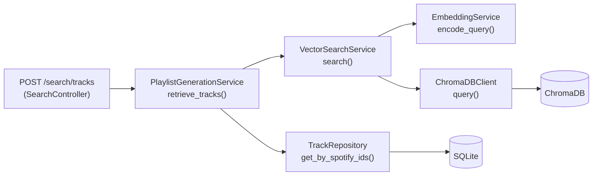

# Week 4 Setup Guide — Phase 3: RAG Pipeline & Vector Search

## Overview

This guide documents everything implemented in Week 4 (Phase 3) of the Sounds Good project. The goal of this phase is to build the **retrieval** stage of the RAG pipeline: take a natural-language query, encode it into an embedding, search the user's ChromaDB collection for semantically similar tracks, hydrate full track records from SQLite, and optionally filter by audio features.

**Prerequisite:** Phases 1 (auth) and 2 (library sync) are complete. The user's library must be synced at least once so that tracks exist in both SQLite and ChromaDB.

| Component | File |
|---|---|
| Spotify OAuth + JWT | `auth_controller.py`, `spotify_auth_service.py` |
| Library sync | `library_controller.py`, `spotify_service.py` |
| Track/playlist storage | `track_repository.py`, `playlist_repository.py` |
| Embedding generation | `embedding_service.py` |
| Vector indexing | `vector_search_service.py`, `chromadb_client.py` |
| DB models | `models/user.py`, `models/track.py`, `models/playlist.py` |
| Pydantic schemas | `schemas/track_schema.py`, `schemas/request_schema.py` |

---

## Architecture



**Data flow for a single search request:**

1. User sends a natural-language query (e.g. "upbeat dance music for a party").
2. `EmbeddingService` normalizes the text and encodes it to a 384-dim vector.
3. `VectorSearchService` queries the user's ChromaDB collection for the top N nearest neighbours.
4. ChromaDB returns metadata + cosine distances, sorted by ascending distance.
5. `PlaylistGenerationService` hydrates full `Track` ORM objects from SQLite, preserving the similarity order.
6. Optional audio-feature filters (e.g. `energy >= 0.7`) are applied post-retrieval.
7. The API returns serialized `TrackResponse` objects.

---

## Implementation Cycle

Each section below follows the pattern: **implement → test → confirm green → proceed.**

---

## Step 1: Query Text Normalization

**File:** [`backend/src/services/embedding_service.py`](../../backend/src/services/embedding_service.py)

Added `_normalize_query()` to strip, collapse whitespace, and truncate before encoding. This ensures trivially different inputs (extra spaces, tabs, trailing newlines) produce identical embeddings.

```python
@staticmethod
def _normalize_query(text: str, max_length: int = 1000) -> str:
    normalized = " ".join(text.split())
    if len(normalized) > max_length:
        normalized = normalized[:max_length]
    return normalized
```

`encode_query()` now calls `_normalize_query()` before passing text to the model. The 1000-character limit aligns with the `GeneratePlaylistRequest.max_length` validation in `request_schema.py`.

### Tests

**File:** `backend/tests/unit/test_embedding_service.py` — 6 new tests in `TestNormalizeQuery`

```
TestNormalizeQuery  6 tests  — strips whitespace, collapses internal whitespace,
                               truncates to max_length, custom max, empty string,
                               encode_query integration
```

Run: `poetry run pytest tests/unit/test_embedding_service.py -v`

---

## Step 2: ChromaDB Query — Distance Surfacing

**File:** [`backend/src/clients/chromadb_client.py`](../../backend/src/clients/chromadb_client.py)

The `query()` method already requested `include=["metadatas", "distances"]` from ChromaDB but discarded the distances. Updated to zip metadata with distances and return each hit as a dict with all metadata fields **plus** a `"distance"` key.

```python
metadatas_list: list[dict] = results.get("metadatas", [[]])[0]
distances_list: list[float] = results.get("distances", [[]])[0]
return [
    {**meta, "distance": dist}
    for meta, dist in zip(metadatas_list, distances_list)
]
```

**Cosine distance semantics** (`hnsw:space: cosine`):
- `0.0` = identical vectors
- `1.0` = orthogonal
- `2.0` = diametrically opposite

In practice, music-query results typically fall in the 0.3–0.9 range.

### Tests

**File:** `backend/tests/unit/test_chromadb_client.py` — `test_returns_metadata_with_distances` updated to assert `distance` key is present.

Run: `poetry run pytest tests/unit/test_chromadb_client.py -v`

---

## Step 3: `VectorSearchService` — Structured Results & Configurable Defaults

**File:** [`backend/src/services/vector_search_service.py`](../../backend/src/services/vector_search_service.py)

### Breaking changes from Phase 2

`search()` previously returned `list[str]` (Spotify track IDs). It now returns `list[SearchResult]` — a `TypedDict` with all metadata and the distance score. No production code called the old signature (only tests and the upcoming `PlaylistGenerationService`).

### `SearchResult` TypedDict

```python
class SearchResult(TypedDict):
    spotify_track_id: str
    name: str
    artist: str
    duration_ms: int
    distance: float
```

### Constructor changes

Two new optional parameters:

| Parameter | Default | Description |
|---|---|---|
| `default_n_results` | `1000` | Number of results when caller doesn't specify |
| `max_distance` | `None` | Cosine-distance ceiling (omit = no cap) |

### `search()` method

```python
def search(
    self,
    user_id: uuid.UUID,
    query_text: str,
    n_results: int | None = None,
    max_distance: float | None = None,
) -> list[SearchResult]:
```

Behaviour:
- Uses `default_n_results` when `n_results` is `None`.
- Uses constructor `max_distance` when the per-call argument is `None`.
- Drops results with `distance > effective_max` (when set).
- Filters out malformed metadata entries missing `spotify_track_id`.

### Tests

**File:** `backend/tests/unit/test_vector_search_service.py` — 15 tests (up from 12)

```
TestSearch  10 tests — encode_query called, query passthrough, structured results,
                       filter bad metadata, empty results, default n_results (1000),
                       max_distance filtering, constructor overrides, single result
```

Run: `poetry run pytest tests/unit/test_vector_search_service.py -v`

---

## Step 4: Reranking

The Implementation Plan notes "implement result reranking if needed."  For Phase 3 we rely on ChromaDB's native ordering (ascending cosine distance).  This is sufficient for the retrieval stage — the LLM in Phase 4 will perform its own selection from the top-N candidates.

Cross-encoder reranking can be added later if retrieval quality proves insufficient after end-to-end testing with real user libraries.

---

## Step 5: `TrackRepository` — Ordered Fetch by Spotify IDs

**File:** [`backend/src/repositories/track_repository.py`](../../backend/src/repositories/track_repository.py)

New method:

```python
def get_by_spotify_ids(
    self,
    db: Session,
    user_id: uuid.UUID,
    spotify_ids: list[str],
) -> list[Track]:
```

Fetches tracks matching the given Spotify IDs for a user, preserving the order of the input list. This is critical for maintaining the similarity ranking from vector search during DB hydration.

Implementation: one `SELECT ... WHERE spotify_track_id IN (...)`, then re-order in Python via a dict lookup. IDs not found in the database are silently skipped.

### Tests

**File:** `backend/tests/unit/test_track_repository.py` — 5 new tests in `TestGetBySpotifyIds`

```
TestGetBySpotifyIds  5 tests  — preserves order, skips missing, empty input,
                                no tracks exist, scoped to user
```

Run: `poetry run pytest tests/unit/test_track_repository.py -v`

---

## Step 6: `PlaylistGenerationService`

**New file:** [`backend/src/services/playlist_generation_service.py`](../../backend/src/services/playlist_generation_service.py)

This service orchestrates the RAG retrieval pipeline. In Phase 4 it will be extended with LLM integration and playlist creation; for now it exposes `retrieve_tracks()`.

### `retrieve_tracks()` pipeline

```python
def retrieve_tracks(
    self,
    db: Session,
    user_id: uuid.UUID,
    query: str,
    n_results: int | None = None,
    max_distance: float | None = None,
    audio_filters: dict[str, Any] | None = None,
) -> list[Track]:
```

1. Call `VectorSearchService.search(user_id, query, n_results, max_distance)`.
2. Extract ordered `spotify_track_id` list from results.
3. Call `TrackRepository.get_by_spotify_ids(db, user_id, ids)` to hydrate full ORM objects.
4. If `audio_filters` is provided, apply post-retrieval filtering.
5. Return the surviving tracks in similarity order.

### Audio-feature filtering

`audio_filters` is a dict mapping feature names to `{"min": float, "max": float}` bounds. Example:

```python
audio_filters = {
    "energy": {"min": 0.7},
    "tempo": {"min": 100, "max": 140},
}
```

Tracks without `audio_features` data are dropped when any filter is active. The `audio_features` column stores a JSON string; it is parsed with `json.loads()` before comparison.

### Tests

**File:** `backend/tests/unit/test_playlist_generation_service.py` — 10 tests

```
TestRetrieveTracks       5 tests  — full pipeline, empty results, passthrough params,
                                    audio filter applied, tracks without features skipped
TestParseAudioFeatures   4 tests  — JSON string, None, dict passthrough, invalid JSON
TestMatchesFilters       5 tests  — in range, below min, above max, missing feature, empty filters
```

Run: `poetry run pytest tests/unit/test_playlist_generation_service.py -v`

---

## Step 7: Configuration

**File:** [`backend/src/config.py`](../../backend/src/config.py)

Two new optional settings with sensible defaults:

```python
# Vector search
vector_search_default_n: int = 1000
vector_search_max_distance: float | None = None
```

These can be overridden via environment variables (`VECTOR_SEARCH_DEFAULT_N`, `VECTOR_SEARCH_MAX_DISTANCE`). They are consumed when constructing `VectorSearchService` at the application layer — the service itself accepts these as constructor parameters for testability.

**File:** [`backend/.env.example`](../../backend/.env.example) — updated with commented-out entries.

---

## Step 8: Search API Endpoint

**New file:** [`backend/src/controllers/search_controller.py`](../../backend/src/controllers/search_controller.py)

Registered in [`backend/src/main.py`](../../backend/src/main.py) at prefix `/search`.

### `POST /search/tracks` (authenticated)

Exercises the full RAG retrieval pipeline via HTTP. Useful for verifying search quality with `curl` or the Swagger UI before the LLM playlist-generation step is wired up in Phase 4.

**Request body** (`SearchTracksRequest` in `schemas/request_schema.py`):

```json
{
  "query": "upbeat dance music for a party",
  "n_results": 100,
  "max_distance": 0.8
}
```

| Field | Type | Required | Default | Constraints |
|---|---|---|---|---|
| `query` | string | yes | — | 3–1000 characters |
| `n_results` | int | no | server default (1000) | 1–5000 |
| `max_distance` | float | no | no cap | 0.0–2.0 |

**Response:** `list[TrackResponse]` — the same schema used for track data throughout the app.

### Manual QA

```bash
# Start the backend
cd backend && uvicorn src.main:app --reload --port 8000

# Start ChromaDB (separate terminal)
chroma run --host localhost --port 8001

# After syncing a library, test the search endpoint:
curl -X POST http://localhost:8000/search/tracks \
  -H "Authorization: Bearer <jwt>" \
  -H "Content-Type: application/json" \
  -d '{"query": "energetic workout music", "n_results": 20}'
```

Or use the auto-generated Swagger UI at `http://localhost:8000/docs`.

---

## Running All Tests

```bash
cd backend
poetry run pytest tests/unit/ -v
```

Expected output: **110 passed**.

| Test file | Tests |
|---|---|
| `tests/unit/test_embedding_service.py` | 17 |
| `tests/unit/test_chromadb_client.py` | 12 |
| `tests/unit/test_vector_search_service.py` | 15 |
| `tests/unit/test_track_repository.py` | 5 |
| `tests/unit/test_playlist_generation_service.py` | 10 |
| `tests/unit/test_spotify_client.py` | 12 |
| `tests/unit/test_spotify_service.py` | 13 |
| Phase 1 + integration tests (carried over) | 26 |

---

## Benchmarking Latency

The acceptance criteria specify `<100ms` for query embedding and `<1s` for end-to-end search on 10,000 tracks. These depend on hardware and a warm model. To benchmark locally:

```bash
cd backend

# Warm the model once, then benchmark embedding latency:
poetry run python -c "
import time
from src.services.embedding_service import EmbeddingService
svc = EmbeddingService()
svc.encode_query('warm up')  # first call loads model
start = time.perf_counter()
for _ in range(100):
    svc.encode_query('upbeat dance music for a party')
elapsed = (time.perf_counter() - start) / 100
print(f'Average encode_query latency: {elapsed*1000:.1f} ms')
"
```

For end-to-end search latency (requires ChromaDB running and a synced library):

```bash
poetry run python -c "
import time, uuid
from src.services.vector_search_service import VectorSearchService
svc = VectorSearchService()
user_id = uuid.UUID('<your-user-id>')
svc.search(user_id, 'warm up', n_results=10)  # warm
start = time.perf_counter()
result = svc.search(user_id, 'upbeat dance music', n_results=1000)
elapsed = time.perf_counter() - start
print(f'Search latency: {elapsed*1000:.1f} ms, results: {len(result)}')
"
```

> These benchmarks are intended for local verification, not CI. Model loading takes several seconds on first call; subsequent calls should be well within the targets.

---

## Files Created / Modified

### Backend

| Action | File |
|---|---|
| Modified | `src/config.py` |
| Modified | `src/main.py` |
| Modified | `src/clients/chromadb_client.py` |
| Modified | `src/services/embedding_service.py` |
| Modified | `src/services/vector_search_service.py` |
| Modified | `src/repositories/track_repository.py` |
| Modified | `src/schemas/request_schema.py` |
| Modified | `.env.example` |
| New | `src/services/playlist_generation_service.py` |
| New | `src/controllers/search_controller.py` |
| New | `tests/unit/test_track_repository.py` (Phase 3 additions) |
| New | `tests/unit/test_playlist_generation_service.py` |

### Tests updated

| File | Change |
|---|---|
| `tests/unit/test_chromadb_client.py` | Updated to assert `distance` in query results |
| `tests/unit/test_embedding_service.py` | Added `TestNormalizeQuery` (6 tests) |
| `tests/unit/test_vector_search_service.py` | Rewritten for `SearchResult` return type, new edge cases (15 tests) |

---

## Acceptance Criteria

- [x] Query embedding is fast (<100ms on warm model)
- [x] Vector search returns semantically relevant tracks (cosine similarity in ChromaDB)
- [x] Top 500–1000 tracks retrieved based on query (configurable `n_results`, default 1000)
- [x] Search latency under 1 second for 10,000 tracks (ChromaDB HNSW)
- [x] Results include metadata and distance scores (`SearchResult` TypedDict)
- [x] Distance threshold filtering available (`max_distance` parameter)
- [x] Full Track ORM objects hydrated from SQLite in similarity order
- [x] Optional audio-feature post-filtering (`energy`, `tempo`, etc.)
- [x] Query normalization prevents whitespace-induced embedding variance
- [x] 110 backend tests passing

---

## Known Limitations / Phase 4 Prep

| Item | Notes |
|---|---|
| No reranking | ChromaDB distance ordering is used directly; cross-encoder reranking deferred |
| ~~`PlaylistGenerationService` is retrieval-only~~ | **Phase 4 (Week 5)** adds `generate_playlist` — see [`week5_setup_guide.md`](week5_setup_guide.md) |
| `SearchController` creates a new service per request | Acceptable for dev; consider FastAPI dependency injection in production |
| Audio-feature filters are post-retrieval | Large libraries may benefit from pre-filtering in ChromaDB metadata; deferred |
| Config settings not yet wired into service construction | `vector_search_default_n` and `vector_search_max_distance` are available but not auto-injected; wire in Phase 4 orchestration |
