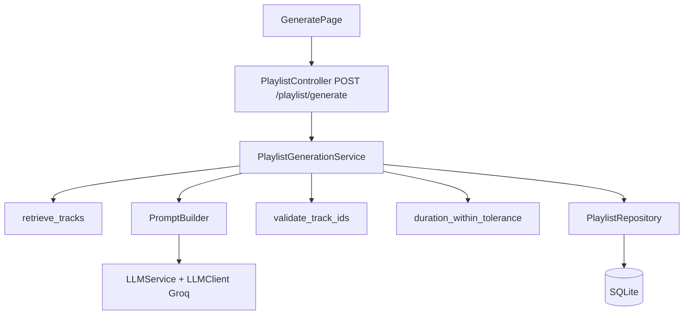

# Week 5 Setup Guide — Phase 4: LLM Integration & Playlist Generation

## Overview

This guide documents Week 5 (Phase 4) of the Sounds Good project: **end-to-end AI playlist generation**. After a user describes what they want in natural language, the backend:

1. **Retrieves** semantically similar tracks from the user’s library (RAG — same pipeline as Phase 3).
2. **Builds** a compact prompt listing candidate tracks (Spotify IDs + metadata).
3. **Calls Groq** (`llama-3.3-70b-versatile` by default) to return JSON: playlist `name` + ordered `track_ids`.
4. **Validates** that every ID appears in the candidate set (no hallucinated IDs).
5. **Checks** total duration against an inferred target (±15 minutes tolerance).
6. **Retries** with corrective feedback up to **2** attempts (configurable).
7. **Persists** a `Playlist` row (`spotify_playlist_id` is `NULL` until Phase 5) and `PlaylistTrack` rows.

**Prerequisites:** Phases 1–3 complete — user authenticated, library synced, ChromaDB indexed. Set `GROQ_API_KEY` in `.env`.

| Component | File |
|-----------|------|
| Groq client | [`backend/src/clients/llm_client.py`](../../backend/src/clients/llm_client.py) |
| JSON parsing | [`backend/src/services/llm_service.py`](../../backend/src/services/llm_service.py) |
| Prompts | [`backend/src/services/prompt_builder.py`](../../backend/src/services/prompt_builder.py) |
| ID validation | [`backend/src/services/track_validator.py`](../../backend/src/services/track_validator.py) |
| Duration | [`backend/src/services/duration_matcher.py`](../../backend/src/services/duration_matcher.py) |
| Orchestration | [`backend/src/services/playlist_generation_service.py`](../../backend/src/services/playlist_generation_service.py) |
| Persistence | [`backend/src/repositories/playlist_repository.py`](../../backend/src/repositories/playlist_repository.py) |
| API | [`backend/src/controllers/playlist_controller.py`](../../backend/src/controllers/playlist_controller.py) |
| Config | [`backend/src/config.py`](../../backend/src/config.py) |
| UI | [`frontend/src/pages/GeneratePage.tsx`](../../frontend/src/pages/GeneratePage.tsx) |

---

## Architecture



**LLM JSON contract** (assistant must return **only** this object):

```json
{
  "name": "Short playlist title",
  "track_ids": ["spotifyTrackId22chars01", "spotifyTrackId22chars02"]
}
```

Every `track_ids` entry must be copied from the candidate list in the prompt.

---

## Environment

| Variable | Purpose |
|----------|---------|
| `GROQ_API_KEY` | Required — from [Groq Console](https://console.groq.com/) |
| `GROQ_MODEL` | Default `llama-3.3-70b-versatile` (see [Groq deprecations](https://console.groq.com/docs/deprecations)) |
| `GROQ_REQUEST_TIMEOUT_S` | Default `90` |
| `GROQ_HTTP_MAX_RETRIES` | HTTP-level retries for 429/5xx (default `3`) |
| `PLAYLIST_GENERATION_MAX_CANDIDATES` | Cap RAG candidates sent to the LLM (default `80`; increase only with a higher Groq tier) |
| `PLAYLIST_GENERATION_MAX_CANDIDATE_CHARS` | Hard cap on candidate-list size in chars (default `22000`) |
| `PLAYLIST_GENERATION_MAX_ATTEMPTS` | Orchestration attempts (default `2`) |
| `DURATION_TOLERANCE_MINUTES` | ± window vs inferred target (default `15`) |
| `DEFAULT_TARGET_DURATION_MINUTES` | If no duration parsed from text (default `45`) |

See [`backend/.env.example`](../../backend/.env.example) for commented examples.

---

## Implementation Cycle

Each section: **implement → test → confirm green → proceed.**

---

## Step 1: Configuration

**File:** [`backend/src/config.py`](../../backend/src/config.py)

Adds Groq-related settings with defaults so local `.env` only needs `GROQ_API_KEY` plus existing secrets.

### Tests

Config is covered indirectly; run `poetry run pytest tests/unit/test_duration_matcher.py -v` after Step 4.

---

## Step 2: Groq client (`LLMClient`)

**File:** [`backend/src/clients/llm_client.py`](../../backend/src/clients/llm_client.py)

- Uses the official **`groq`** Python package (see [`backend/pyproject.toml`](../../backend/pyproject.toml)).
- `chat_completion(..., json_mode=True)` sets `response_format: { type: json_object }` for structured output.
- Retries on `APIStatusError` with status `429`, `500`, `502`, `503` with exponential backoff.

### Tests

Covered via mocked `LLMService` in unit/integration tests; live Groq calls are not required in CI.

---

## Step 3: `LLMService` — parse JSON

**File:** [`backend/src/services/llm_service.py`](../../backend/src/services/llm_service.py)

- `PlaylistLLMOutput` (Pydantic): `name`, `track_ids`.
- Strips optional ` ```json ` fences before `json.loads`.
- On `json_object` failure, falls back to a second request without `response_format` (implementation detail).

---

## Step 4: `PromptBuilder`

**File:** [`backend/src/services/prompt_builder.py`](../../backend/src/services/prompt_builder.py)

- System message: JSON-only instructions + duration guidance.
- User message: user text + numbered lines `index. spotify_id | title | artist | mm:ss`.
- Truncates to `playlist_generation_max_candidates` tracks and to `playlist_generation_max_candidate_chars` (long libraries stay under Groq token limits).

### Tests

```bash
poetry run pytest tests/unit/test_prompt_builder.py -v
```

---

## Step 5: `TrackValidator` & `DurationMatcher`

**Files:**

- [`backend/src/services/track_validator.py`](../../backend/src/services/track_validator.py) — `validate_track_ids` (unknown IDs dropped, not retried)
- [`backend/src/services/duration_matcher.py`](../../backend/src/services/duration_matcher.py) — `infer_target_duration_ms`, `total_duration_ms`, `duration_within_tolerance`, `duration_feedback`

### Tests

```bash
poetry run pytest tests/unit/test_track_validator.py tests/unit/test_duration_matcher.py -v
```

---

## Step 6: `PlaylistRepository` — AI playlists

**File:** [`backend/src/repositories/playlist_repository.py`](../../backend/src/repositories/playlist_repository.py)

- `create_ai_playlist(db, user_id, name)` — `spotify_playlist_id=None`
- `get_with_tracks(db, playlist_id)` — `selectinload` for `playlist_tracks` + `track`

### Tests

```bash
poetry run pytest tests/unit/test_playlist_repository.py::TestCreateAiPlaylist tests/unit/test_playlist_repository.py::TestGetWithTracks -v
```

---

## Step 7: `PlaylistGenerationService.generate_playlist`

**File:** [`backend/src/services/playlist_generation_service.py`](../../backend/src/services/playlist_generation_service.py)

- `retrieve_tracks` → slice candidates → loop (max attempts):
  - `PromptBuilder.build_messages`
  - `LLMService.generate_playlist_output`
  - validate IDs ⊆ candidates
  - duration check
  - on success: `create_ai_playlist` + `add_tracks` + `get_with_tracks`
- Errors: `400` + `no_candidates` if RAG returns nothing; `502` + `playlist_generation_failed` after exhausted retries.

### Tests

```bash
poetry run pytest tests/unit/test_playlist_generation_service.py::TestGeneratePlaylist -v
```

---

## Step 8: HTTP API

**Files:**

- [`backend/src/controllers/playlist_controller.py`](../../backend/src/controllers/playlist_controller.py) — `POST /playlist/generate`, body [`GeneratePlaylistRequest`](../../backend/src/schemas/request_schema.py), response [`PlaylistResponse`](../../backend/src/schemas/playlist_schema.py)
- [`backend/src/main.py`](../../backend/src/main.py) — `include_router(playlist_router)`

The frontend calls **`POST /playlist/generate`** (not under `/search`).

### Tests

```bash
poetry run pytest tests/integration/test_playlist_controller.py -v
```

---

## Manual check (curl)

With a valid JWT and `GROQ_API_KEY` set:

```bash
curl -s -X POST "http://localhost:8000/playlist/generate" \
  -H "Authorization: Bearer <JWT>" \
  -H "Content-Type: application/json" \
  -d '{"text": "About 45 minutes of calm music"}' | jq
```

---

## Acceptance Criteria

- [x] LLM path completes within typical Groq latency (<30s under normal conditions)
- [x] Recommended tracks are a subset of RAG candidates (therefore in the user’s library)
- [x] Duration checked against inferred target ±15 minutes
- [x] Up to 2 orchestration attempts with feedback (default)
- [x] UI displays playlist name, track list, durations
- [x] `POST /playlist/generate` registered and tested

---

## Deferred to Phase 5

| Item | Notes |
|------|------|
| **Save to Spotify** | Button on Generate page; backend endpoint and `SpotifyService` playlist creation |

---

## Files Created / Modified (Phase 4)

### Backend

| Action | File |
|--------|------|
| Modified | `src/config.py` |
| Modified | `src/main.py` |
| Modified | `src/repositories/playlist_repository.py` |
| Modified | `pyproject.toml` / `poetry.lock` (add `groq`) |
| Modified | `.env.example` |
| New | `src/clients/llm_client.py` |
| New | `src/services/llm_service.py` |
| New | `src/services/prompt_builder.py` |
| New | `src/services/track_validator.py` |
| New | `src/services/duration_matcher.py` |
| New | `src/controllers/playlist_controller.py` |
| Modified | `src/services/playlist_generation_service.py` |

### Tests

| File |
|------|
| `tests/unit/test_prompt_builder.py` |
| `tests/unit/test_llm_service.py` |
| `tests/unit/test_track_validator.py` |
| `tests/unit/test_duration_matcher.py` |
| `tests/unit/test_playlist_generation_service.py` ( `TestGeneratePlaylist` ) |
| `tests/unit/test_playlist_repository.py` ( `TestCreateAiPlaylist`, `TestGetWithTracks` ) |
| `tests/integration/test_playlist_controller.py` |

---

## Full test run

```bash
cd backend && poetry run pytest tests/ -q
```

Expected: all tests green (150+).
