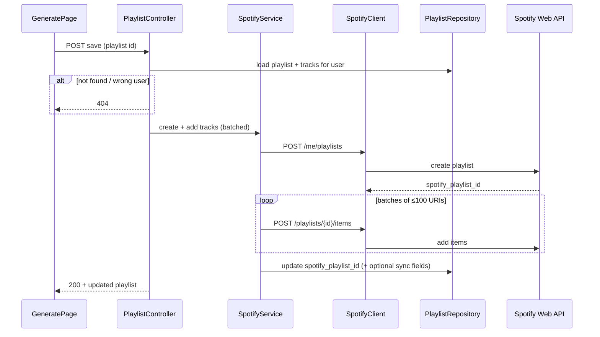

# Week 6 Setup Guide — Phase 5: Spotify Playlist Creation

## Overview

This guide documents **Week 6 (Phase 5)** of the Sounds Good project: **persisting AI-generated playlists to the user’s Spotify account**. After Phase 4, playlists exist only in SQLite (`Playlist` + `PlaylistTrack`); `spotify_playlist_id` is `NULL`. Phase 5 adds:

1. **Spotify Web API calls** to create a playlist owned by the user and add tracks in batches (Spotify allows up to **100** URIs per `Add Items to Playlist` request).
2. **Local linkage** — update the same `Playlist` row with the new Spotify playlist ID (and optionally record sync status / timestamps).
3. **API + UI** — authenticated endpoint (e.g. `POST /playlist/{id}/save-to-spotify` or similar) and a working **Save to Spotify** control on [`GeneratePage`](../../frontend/src/pages/GeneratePage.tsx) (currently disabled with “Phase 5” placeholder).

**Prerequisites:** Phases 1–4 complete — user has Spotify OAuth with modify scopes, library synced, and at least one successful `POST /playlist/generate`. OAuth already includes `playlist-modify-public` and `playlist-modify-private` (see [`SPOTIFY_SCOPES`](../../backend/src/clients/spotify_client.py)).

| Component | Role |
|-----------|------|
| HTTP to Spotify | [`backend/src/clients/spotify_client.py`](../../backend/src/clients/spotify_client.py) — add `create_playlist`, `add_tracks_to_playlist` (batched) |
| Orchestration + token | [`backend/src/services/spotify_service.py`](../../backend/src/services/spotify_service.py) — wrap client with `get_valid_access_token`, reuse existing backoff patterns where appropriate |
| DB updates | [`backend/src/repositories/playlist_repository.py`](../../backend/src/repositories/playlist_repository.py) — e.g. `link_spotify_playlist(db, playlist_id, spotify_playlist_id)` and optional sync metadata |
| HTTP API | [`backend/src/controllers/playlist_controller.py`](../../backend/src/controllers/playlist_controller.py) — new route; ownership check (playlist belongs to `current_user`) |
| Schemas | [`backend/src/schemas/playlist_schema.py`](../../backend/src/schemas/playlist_schema.py) — response shape after save (include `spotify_playlist_id` / external URL if desired) |
| UI | [`frontend/src/pages/GeneratePage.tsx`](../../frontend/src/pages/GeneratePage.tsx) — enable button, loading, success, errors, retry |

**Reference:** [Spotify — Create playlist](https://developer.spotify.com/documentation/web-api/reference/create-playlist), [Add items to playlist](https://developer.spotify.com/documentation/web-api/reference/add-items-to-playlist) (not the deprecated `.../tracks` route).

---

## Architecture



**Track URI format:** `spotify:track:{22-char-id}` — build from each row’s `Track.spotify_id` (already stored during library sync).

---

## Spotify API essentials

| Concern | Detail |
|--------|--------|
| Create playlist | Use **`POST /v1/me/playlists`** ([Create playlist](https://developer.spotify.com/documentation/web-api/reference/create-playlist)); the access token identifies the user. The deprecated `POST /v1/users/{user_id}/playlists` path is not used. |
| Playlist visibility | `public` / `collaborative` / `description` — pick sensible defaults (e.g. private playlist, short description mentioning Sounds Good). |
| Batching | `POST /playlists/{playlist_id}/items` ([Add items to playlist](https://developer.spotify.com/documentation/web-api/reference/add-items-to-playlist)) accepts up to **100** URIs per request; chunk longer lists. |
| Ordering | Preserve `PlaylistTrack.position` when building URI lists. |
| Rate limits | Reuse `_with_backoff` / `ExternalServiceError` handling consistent with [`SpotifyService.sync_library`](../../backend/src/services/spotify_service.py). |
| Idempotency | If save is retried after partial success, define behavior (e.g. detect existing `spotify_playlist_id` and return 409 or skip create and only add missing tracks — product decision). |

---

## Implementation cycle

Follow: **implement → unit/integration tests → manual check in Spotify app → proceed.**

---

## Step 1: `SpotifyClient` — create playlist & add tracks

**File:** [`backend/src/clients/spotify_client.py`](../../backend/src/clients/spotify_client.py)

Add low-level methods:

- `create_playlist(access_token, name, *, description, public)` → `POST {SPOTIFY_API_BASE}/me/playlists` per [Create playlist](https://developer.spotify.com/documentation/web-api/reference/create-playlist); return parsed JSON including `id`.
- `add_tracks_to_playlist(access_token, playlist_id, track_uris)` — if `len(track_uris) > 100`, either split inside this method or expose a single-batch method and let the service loop (keep one clear place for batching).

Raise `ExternalServiceError` on non-success status codes with response text for debugging.

### Tests

- Mock `httpx` responses: 201 create, 200/201 add tracks; verify batching splits 150 URIs into two requests.
- Error paths: 401, 403, 429 (service layer may retry).

---

## Step 2: `SpotifyService` — high-level save

**File:** [`backend/src/services/spotify_service.py`](../../backend/src/services/spotify_service.py)

Add something like:

- `async def push_playlist_to_spotify(user_id: UUID, db: Session, local_playlist_id: UUID) -> ...`

Responsibilities:

1. Resolve **valid access token** via `SpotifyAuthService.get_valid_access_token`.
2. Load ordered tracks for the playlist (Spotify IDs from `Track.spotify_id`).
3. Call `create_playlist` (uses `/me/playlists` with the user’s access token) then batched `add_tracks_to_playlist`.
4. Return the new Spotify playlist id (and optionally external URL: `https://open.spotify.com/playlist/{id}`).

Keep HTTP concerns in `SpotifyClient`; keep DB reads/writes delegated to the repository from the controller or a thin orchestration method to avoid circular imports.

---

## Step 3: `PlaylistRepository` — link Spotify id

**File:** [`backend/src/repositories/playlist_repository.py`](../../backend/src/repositories/playlist_repository.py)

- Add `link_spotify_playlist(db, playlist_id, user_id, spotify_playlist_id)` that updates the row **only if** `Playlist.user_id == user_id` (prevent cross-user updates). Alternatively merge into existing `upsert` semantics if it fits — but AI playlists start without a Spotify id, so an explicit update method is usually clearer.

**Optional (per Implementation Plan — “track sync status”):**

- Add nullable columns via Alembic migration, e.g. `spotify_synced_at` (datetime) and/or `spotify_sync_error` (text, last failure). If you prefer minimal schema change, treating “synced” as `spotify_playlist_id is not None` is acceptable for MVP; document the choice in this guide’s “Decisions” section.

---

## Step 4: HTTP API

**File:** [`backend/src/controllers/playlist_controller.py`](../../backend/src/controllers/playlist_controller.py)

- New route, e.g. `POST /playlist/{playlist_id}/save-to-spotify` (under the same `/playlist` prefix).
- Dependencies: `get_current_user`, `get_db`.
- Load playlist with tracks; 404 if missing or not owned.
- If `spotify_playlist_id` already set, return **409 Conflict** or idempotent 200 — choose one and document.
- Call async `SpotifyService` method (use FastAPI’s async route or `asyncio.run` only if unavoidable — prefer consistent async style with the rest of the app).
- `db.commit()` after successful link.

**Schemas:** extend [`playlist_schema.py`](../../backend/src/schemas/playlist_schema.py) if the client should show Spotify URL or sync timestamp.

---

## Step 5: Frontend — Save to Spotify

**File:** [`frontend/src/pages/GeneratePage.tsx`](../../frontend/src/pages/GeneratePage.tsx)

- Replace the disabled button with:
  - `isSaving` state; disable while saving.
  - `POST` to the new endpoint with `playlist.id`.
  - On success: show confirmation (inline message or brief toast pattern consistent with the app), optionally show “Open in Spotify” if API returns URL.
  - On error: show message from API; **Retry** button that repeats the save.
- Update local `playlist` state if response includes `spotify_playlist_id` so UI can show “Saved” and avoid duplicate creates.

---

## Testing checklist (from Implementation Plan)

| Area | What to cover |
|------|----------------|
| Unit | Batching math (0, 1, 100, 101 tracks); URI format; repository guard on `user_id`. |
| Integration | Mock Spotify API — create returns id, adds succeed; failure mid-batch if you implement compensating behavior. |
| Manual | Generate playlist → Save → open Spotify app and verify name + track order + count. |

---

## Acceptance Criteria

- [ ] Playlists are created in the user’s Spotify account with the generated name (or agreed policy).
- [ ] All tracks from the local playlist are added in order, including lists **> 100** tracks (batched).
- [ ] User receives clear confirmation in the UI; errors are readable with optional retry.
- [ ] Local `Playlist` row stores `spotify_playlist_id` after success.
- [ ] Automated tests cover core paths and batching.

---

## Manual check (after implementation)

Replace placeholders:

```bash
# 1) Obtain JWT as you do for other protected routes
export JWT="<your-jwt>"

# 2) Generate a playlist and note playlist id from JSON
curl -s -X POST "http://localhost:8000/playlist/generate" \
  -H "Authorization: Bearer $JWT" \
  -H "Content-Type: application/json" \
  -d '{"text": "30 minutes of calm"}' | jq -r '.id'

# 3) Save to Spotify
export PID="<playlist-uuid-from-step-2>"
curl -s -X POST "http://localhost:8000/playlist/$PID/save-to-spotify" \
  -H "Authorization: Bearer $JWT" | jq
```

Response includes `spotify_playlist_id` and `spotify_playlist_url` when successful. `409` if that playlist was already linked to Spotify.

Verify in the Spotify desktop or mobile app under the user’s playlists.

---

## Deferred to Phase 6+

| Item | Notes |
|------|------|
| Redis / caching | Phase 6 |
| Uploading custom playlist cover image | Out of scope unless added later (`ugc-image-upload` is in scopes) |
| Editing an existing Spotify playlist from the app | Not required for Phase 5 MVP |

---

## Related documentation

- Master plan: [`docs/plan/Implementation_Plan.md`](../plan/Implementation_Plan.md) — **Phase 5** section.
- Previous phase: [`week5_setup_guide.md`](week5_setup_guide.md) — generation pipeline and deferred “Save to Spotify”.

---

## Full backend test run (regression)

```bash
cd backend && poetry run pytest tests/ -q
```

All existing tests should remain green after Phase 5 changes; new tests added for playlist save flow.
